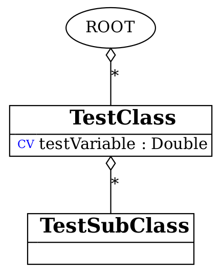
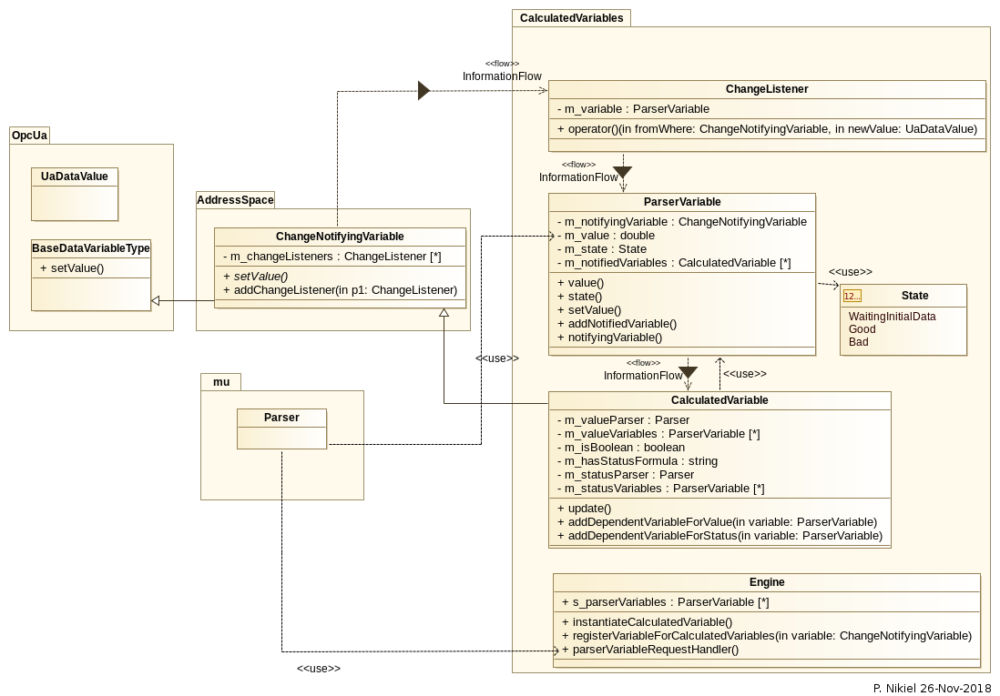
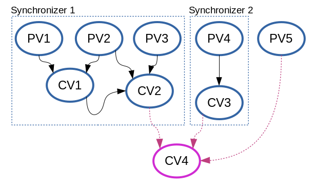

Calculated Variables
====================

|
| by: Piotr Nikiel, Paris Moschovakos
| Created Oct-Nov 2018
| Updated September 2022
| Updated July 2023

Overview and end-user documentation
-----------------------------------

Preface
-------

| The concepts and work embodied in the quasar's CalculatedVariables 
  module draw significant inspiration from the "CalculatedItems" concept 
  in the CANopen OPC UA server, originally developed by V.Filimonov. 
  This influence is gratefully acknowledged. However, it's important to 
  note that the CalculatedVariables module has been designed entirely 
  from scratch, utilizing an original architecture and different 
  concepts and technologies.

Rationale
---------

| A quasar-based OPC UA server is based on a model of a system it is
  made for. This model is called a design. The model explains (in terms
  of quasar classes, variables etc.) what sources and sinks of
  information the system can publish or digest.

| Often it is practical to add supplementary sources of information -
  like Calculated Variables - on top of what the model already provides.
  The reasons for doing this are often the following:

-  the system already provides information which is expressed in
   quantities different than requested by users.
   Example: an OPC UA server is built for a device which measures period
   of a repetitive process, but the users prefer frequency instead.
   Solution: a Calculated Variable might be added to the server with a
   simple reciprocal (y=1/x) formula to compute frequency in terms of
   period.
-  the system already provides information but in another unit.
-  the system provides raw (e.g. uncalibrated) information.
   Example: an OPC UA server publishes data from Analog to Digital
   Converter. This is raw information though.
   Solution: a Calculated Variable might be added to provide for gain
   and offset calibration.
-  similarly to the example above, the ADC might have the value from a
   conversion of e.g. a temperature sensor. A Calculated Variable might
   be attached with a formula that recomputes the ADC value (in volts)
   into temperature.

Design-based variables vs CalculatedVariables
---------------------------------------------

+-----------------------+-----------------------+-----------------------+
| Aspect                | Design-based variable | Calculated Variable   |
|                       | (cache-variable or    |                       |
|                       | source-variable)      |                       |
+=======================+=======================+=======================+
| Instantiation         | The variable always   | The variable is       |
|                       | belongs to an object  | defined in the        |
|                       | of a quasar class     | configuration file    |
|                       | which is defined by   | which is loaded at    |
|                       | the model (Design).   | runtime.              |
|                       | Therefore it's the    |                       |
|                       | design which          |                       |
|                       | determines its type,  |                       |
|                       | behaviour,            |                       |
|                       | limitations etc.      |                       |
+-----------------------+-----------------------+-----------------------+
| Source of information | Comes from inside of  | Is a result of an     |
|                       | the server, typically | analytical expression |
|                       | from user supplied    | evaluation. The       |
|                       | Device logic. Any     | inputs to the         |
|                       | method available by   | expression can be:    |
|                       | C++ programming can   |                       |
|                       | be used.              | -  literal constants  |
|                       |                       |    (e.g. 1000.0 or    |
|                       |                       |    \_pi)              |
|                       |                       | -  scalar cache       |
|                       |                       |    variables which    |
|                       |                       |    output numbers     |
|                       |                       |    (i.e. are of any   |
|                       |                       |    numeric quasar     |
|                       |                       |    data type)         |
|                       |                       | -  other calculated   |
|                       |                       |    variables          |
|                       |                       | -  free variables     |
|                       |                       | -  config entries of  |
|                       |                       |    numeric data-type  |
+-----------------------+-----------------------+-----------------------+
| Output type           | Any supported by      | Double or boolean     |
|                       | quasar, including     | scalar.               |
|                       | arrays.               |                       |
+-----------------------+-----------------------+-----------------------+
| Adding new variable   | Yes                   | No                    |
| per quasar class      |                       |                       |
| requires              |                       |                       |
| recompilation?        |                       |                       |
+-----------------------+-----------------------+-----------------------+

Feature list
------------

+-----------------------------------+-----------------------------------+
| **Feature**                       | **State**                         |
+-----------------------------------+-----------------------------------+
| Supports all quasar numerical     | Yes                               |
| types                             |                                   |
+-----------------------------------+-----------------------------------+
| Formulas with N inputs            | Yes                               |
+-----------------------------------+-----------------------------------+
| Good/Bad/WaitingForInitialData    | Yes                               |
| support                           |                                   |
+-----------------------------------+-----------------------------------+
| Separate formula for status       | Yes                               |
| evaluation                        |                                   |
+-----------------------------------+-----------------------------------+
| Support for delegated             | Yes                               |
| cache-variables                   |                                   |
+-----------------------------------+-----------------------------------+
| Tracing in separate LogIt         | Yes                               |
| component                         |                                   |
+-----------------------------------+-----------------------------------+
| open62541 compatibility           | Yes                               |
+-----------------------------------+-----------------------------------+
| Initial value support             | Yes                               |
+-----------------------------------+-----------------------------------+
| Evaluation as boolean             | Yes                               |
+-----------------------------------+-----------------------------------+
| Atomic passing of value and       | Yes                               |
| status, thread safety             |                                   |
+-----------------------------------+-----------------------------------+
| Optimizing out variables not used | Yes                               |
| in any expression                 |                                   |
+-----------------------------------+-----------------------------------+
| Formula templates                 | Yes                               |
+-----------------------------------+-----------------------------------+
| Formula inputs from               | Scalar+numeric: cache-variables, config-entries, free-variables and other calculated variables |
+-----------------------------------+-----------------------------------------------------------------------------------------------+

Manual Update and Auto Update Control
-------------------------------------
| An enhancement to the CalculatedVariables module has been introduced. 
  This enhancement enables the automatic update of calculated variables 
  to be controlled and allows for manual triggering of recalculation.

| This functionality proves beneficial in scenarios where the calculated 
  variable is computationally expensive and doesn't need to be updated 
  as frequently, or where more control over when the recalculation 
  occurs is desired.

+------------------------+--------------------------------------------------+
| Method                 | Description                                      |
+========================+==================================================+
| setAutoUpdate(bool)    | This function allows the automatic update of a   |
|                        | calculated variable to be enabled or disabled.   |
|                        | When called with true, the calculated variable   |
|                        | will automatically update whenever any of its    |
|                        | dependencies change. When called with false,     |
|                        | the calculated variable will not update          |
|                        | automatically, and manual triggering of          |
|                        | recalculation is required. The default value is  |
|                        | true.                                            |
+------------------------+--------------------------------------------------+
| triggerRecalculation() | This function manually triggers the              |
|                        | recalculation of a calculated variable. It is    |
|                        | useful when automatic updates are disabled and   |
|                        | a recalculation is needed. When this function    |
|                        | is called, the calculated variable will          |
|                        | recompute its value based on the current values  |
|                        | of its dependencies.                             |
+------------------------+--------------------------------------------------+

Operators and built-in functions
--------------------------------

| A summary of functions, operators and constants which mu::Parser
  supports is pasted here for reference.

| Built-in functions

+-----------------------+-----------------------+-----------------------+
| **Name**              | **Argc.**             | **Explanation**       |
+-----------------------+-----------------------+-----------------------+
| ``sin``               | 1                     | sine function         |
+-----------------------+-----------------------+-----------------------+
| ``cos``               | 1                     | cosine function       |
+-----------------------+-----------------------+-----------------------+
| ``tan``               | 1                     | tangens function      |
+-----------------------+-----------------------+-----------------------+
| ``asin``              | 1                     | arcus sine function   |
+-----------------------+-----------------------+-----------------------+
| ``acos``              | 1                     | arcus cosine function |
+-----------------------+-----------------------+-----------------------+
| ``atan``              | 1                     | arcus tangens         |
|                       |                       | function              |
+-----------------------+-----------------------+-----------------------+
| ``sinh``              | 1                     | hyperbolic sine       |
|                       |                       | function              |
+-----------------------+-----------------------+-----------------------+
| ``cosh``              | 1                     | hyperbolic cosine     |
+-----------------------+-----------------------+-----------------------+
| ``tanh``              | 1                     | hyperbolic tangens    |
|                       |                       | function              |
+-----------------------+-----------------------+-----------------------+
| ``asinh``             | 1                     | hyperbolic arcus sine |
|                       |                       | function              |
+-----------------------+-----------------------+-----------------------+
| ``acosh``             | 1                     | hyperbolic arcus      |
|                       |                       | tangens function      |
+-----------------------+-----------------------+-----------------------+
| ``atanh``             | 1                     | hyperbolic arcur      |
|                       |                       | tangens function      |
+-----------------------+-----------------------+-----------------------+
| ``log2``              | 1                     | logarithm to the base |
|                       |                       | 2                     |
+-----------------------+-----------------------+-----------------------+
| ``log10``             | 1                     | logarithm to the base |
|                       |                       | 10                    |
+-----------------------+-----------------------+-----------------------+
| ``log``               | 1                     | logarithm to base e   |
|                       |                       | (2.71828...)          |
+-----------------------+-----------------------+-----------------------+
| ``ln``                | 1                     | logarithm to base e   |
|                       |                       | (2.71828...)          |
+-----------------------+-----------------------+-----------------------+
| ``exp``               | 1                     | e raised to the power |
|                       |                       | of x                  |
+-----------------------+-----------------------+-----------------------+
| ``sqrt``              | 1                     | square root of a      |
|                       |                       | value                 |
+-----------------------+-----------------------+-----------------------+
| ``sign``              | 1                     | sign function -1 if   |
|                       |                       | x<0; 1 if x>0         |
+-----------------------+-----------------------+-----------------------+
| ``rint``              | 1                     | round to nearest      |
|                       |                       | integer               |
+-----------------------+-----------------------+-----------------------+
| ``abs``               | 1                     | absolute value        |
+-----------------------+-----------------------+-----------------------+
| ``min``               | var.                  | min of all arguments  |
+-----------------------+-----------------------+-----------------------+
| ``max``               | var.                  | max of all arguments  |
+-----------------------+-----------------------+-----------------------+
| ``sum``               | var.                  | sum of all arguments  |
+-----------------------+-----------------------+-----------------------+
| ``avg``               | var.                  | mean value of all     |
|                       |                       | arguments             |
+-----------------------+-----------------------+-----------------------+
| ``pow``               | 2                     | x^y                   |
+-----------------------+-----------------------+-----------------------+

|
| Built-in operators

+-----------------------+-----------------------+-----------------------+
| **Operator**          | **Description**       | **Priority**          |
+=======================+=======================+=======================+
| ``=``                 | assignement           | -1                    |
+-----------------------+-----------------------+-----------------------+
| ``&&``                | logical and           | 1                     |
+-----------------------+-----------------------+-----------------------+
| ``||``                | logical or            | 2                     |
+-----------------------+-----------------------+-----------------------+
| ``<=``                | less or equal         | 4                     |
+-----------------------+-----------------------+-----------------------+
| ``>=``                | greater or equal      | 4                     |
+-----------------------+-----------------------+-----------------------+
| ``!=``                | not equal             | 4                     |
+-----------------------+-----------------------+-----------------------+
| ``==``                | equal                 | 4                     |
+-----------------------+-----------------------+-----------------------+
| ``>``                 | greater than          | 4                     |
+-----------------------+-----------------------+-----------------------+
| ``<``                 | less than             | 4                     |
+-----------------------+-----------------------+-----------------------+
| ``+``                 | addition              | 5                     |
+-----------------------+-----------------------+-----------------------+
| ``-``                 | subtraction           | 5                     |
+-----------------------+-----------------------+-----------------------+
| ``*``                 | multiplication        | 6                     |
+-----------------------+-----------------------+-----------------------+
| ``/``                 | division              | 6                     |
+-----------------------+-----------------------+-----------------------+
| ``^``                 | raise x to the power  | 7                     |
|                       | of y                  |                       |
+-----------------------+-----------------------+-----------------------+

|
| Common mathematical constants
| \_pi, \_e

Configuration file schema regarding Calculated Variables
--------------------------------------------------------

| The XML element type is called CalculatedVariable and it has the
  following attributes:

+-----------------+-----------------+-----------------+-----------------+
| **Name          | **Obligatory?   | **XSD Type**    | **Meaning       |
| **              | **              |                 | **              |
+=================+=================+=================+=================+
| name            | Yes             | xs:string       | Name of this    |
|                 |                 |                 | calculated      |
|                 |                 |                 | variable. Note  |
|                 |                 |                 | that the full   |
|                 |                 |                 | address that    |
|                 |                 |                 | this variable   |
|                 |                 |                 | obtains will be |
|                 |                 |                 | the name        |
|                 |                 |                 | prefixed by the |
|                 |                 |                 | address of      |
|                 |                 |                 | position in the |
|                 |                 |                 | Address Space   |
|                 |                 |                 | where the       |
|                 |                 |                 | variable gets   |
|                 |                 |                 | instantiated.   |
+-----------------+-----------------+-----------------+-----------------+
| value           | Yes             | xs:string       | Value formula,  |
|                 |                 |                 | that is: an     |
|                 |                 |                 | analytical      |
|                 |                 |                 | expression used |
|                 |                 |                 | to evaluate     |
|                 |                 |                 | value of this   |
|                 |                 |                 | variable. Some  |
|                 |                 |                 | examples will   |
|                 |                 |                 | be given below. |
+-----------------+-----------------+-----------------+-----------------+
| initialValue    | No              | xs:double       | Initial value,  |
|                 |                 |                 | i.e. the value  |
|                 |                 |                 | that this       |
|                 |                 |                 | variable will   |
|                 |                 |                 | hold BEFORE     |
|                 |                 |                 | first           |
|                 |                 |                 | evaluation      |
|                 |                 |                 | happens (which  |
|                 |                 |                 | normally is     |
|                 |                 |                 | when all        |
|                 |                 |                 | formula         |
|                 |                 |                 | ingredients     |
|                 |                 |                 | receive the     |
|                 |                 |                 | initial         |
|                 |                 |                 | update). If     |
|                 |                 |                 | initialValue is |
|                 |                 |                 | not given then  |
|                 |                 |                 | the variable    |
|                 |                 |                 | will hold NULL  |
|                 |                 |                 | along           |
|                 |                 |                 | BadWaitin       |
|                 |                 |                 | gForInitialData |
|                 |                 |                 | status.         |
+-----------------+-----------------+-----------------+-----------------+
| isBoolean       | No              | xs:boolean      | Evaluate and    |
|                 |                 |                 | present as      |
|                 |                 |                 | boolean. The    |
|                 |                 |                 | final result    |
|                 |                 |                 | will be         |
|                 |                 |                 | OpcUa_True if   |
|                 |                 |                 | the calculation |
|                 |                 |                 | result is       |
|                 |                 |                 | non-zero.       |
+-----------------+-----------------+-----------------+-----------------+
| status          | No              | xs:string       | Status formula, |
|                 |                 |                 | that is: an     |
|                 |                 |                 | analytical      |
|                 |                 |                 | expression used |
|                 |                 |                 | to evaluate     |
|                 |                 |                 | OPC UA          |
|                 |                 |                 | status-code of  |
|                 |                 |                 | this variable.  |
|                 |                 |                 | The status-code |
|                 |                 |                 | will be         |
|                 |                 |                 | OpcUa_Good if   |
|                 |                 |                 | the formula     |
|                 |                 |                 | evaluates to    |
|                 |                 |                 | non-zero        |
|                 |                 |                 | otherwise       |
|                 |                 |                 | OpcUa_Bad. If   |
|                 |                 |                 | status formula  |
|                 |                 |                 | is not used     |
|                 |                 |                 | then by default |
|                 |                 |                 | the variable is |
|                 |                 |                 | OpcUa_Good when |
|                 |                 |                 | all input       |
|                 |                 |                 | arguments are   |
|                 |                 |                 | in good status, |
|                 |                 |                 | or OpcUa_Bad    |
|                 |                 |                 | otherwise       |
+-----------------+-----------------+-----------------+-----------------+

| The XML element CalculatedVariable can be attached under any quasar
  object declaration as well as on global scope.

Meta-functions and meta-operators (dollar signs in the formulas)
----------------------------------------------------------------

| It is often practical to perform some sort of elaboration of
  configured formulas before they are given to be compiled by the
  formula parser. Such elaboration steps are achieved by placing
  dollar-sign operators and functions in the formulas. For all examples
  below, the following quasar design diagram is used:

| |image1|

$thisObjectAddress
~~~~~~~~~~~~~~~~~~

| ``$thisObjectAddress`` evaluates to the string address of the object under
  which the calculated variable was instantiated. It finds a very
  practical application to build generalized formulas, which can be
  applied "under" multiple places in the address-space, so
  ``$thisObjectAddress`` serves as the relative pointer to the object
  address.
| Using the design as above, the following config file shows a sample
  application:

.. code:: mycode

       <TestClass name="tc">
        <CalculatedVariable name="test_var_multiplied" value="$thisObjectAddress.testVariable * 1000" />
       </TestClass>

$_
~~

``$_`` is an abbreviation for ``$thisObjectAddress`` which comes practical for
long, complex formulas.

$parentObjectAddress(numLevelsUp=N)
~~~~~~~~~~~~~~~~~~~~~~~~~~~~~~~~~~~

| ``$parentObjectAddress`` is a generalization of ``$thisObjectAddress``. For
  N=0 it evaluates to ``$thisObjectAddress``, for N=1 to its parent object
  and so on.
| Using the design as above, the following config file shows a sample
  application:

.. code:: mycode

       <TestClass name="tc">
        <TestSubClass name="tsc">
            <CalculatedVariable name="test_var_multiplied" value="$parentObjectAddress(numLevelsUp=1).testVariable * 1000" />
        </TestSubClass>
       </TestClass>

$applyGenericFormula(formula)
~~~~~~~~~~~~~~~~~~~~~~~~~~~~~

| ``$applyGenericFormula`` is used in the context of generalized function
  templates and `documented there <#Generalized_formula_templates>`__.

Generalized formula templates
-----------------------------

| Multiple sensors of same type are likely to use same formulas (with
  possibly different calibration constants). Thus it is economical to
  share formulas between them if configuration file readability/clarity
  would profit.
| The basic application of generalized formula templates is composed of
  the following steps:

-  defining the generalized formula at the top of the configuration file
   using the CalculatedVariableGenericFormula XML element
-  applying the formula at the point of use using ``$applyGenericFormula``
   meta-function.

| Technically, the job done by quasar for applying the formula at the
  point of use boils down to pasting the formula in place of the
  meta-function. In the future, extending this operation by optional
  arguments, might be considered.

| An example of the generalized formula template from a real system
  (CERN - ATLAS DCS - New Small Wheel project, courtesy of P. Tzanis) is
  given. The generalized formula is put at the top of the configuration
  file:

.. code:: mycode

   <CalculatedVariableGenericFormula name="thermistorTemperature"
         formula="1/( 3.3540154*10^(-3)+(2.5627725*10^(-4)*log(1000*$thisObjectAddress.value/500))+(2.0829210*10^(-6)*(log(1000*$thisObjectAddress.value/500))^2)+(7.3003206*10^(-8)*(log(1000*$thisObjectAddress.value/500))^3)) -273.15"/>

|
| As can be seen, the formula profits from $thisObjectAddress
  meta-function which enables its reuse at any place of the
  configuration (so, consequently, the address-space) which has a
  sibling variable called "value" (which, in the case of the particular
  application, is the converted voltage expressed in volts).
| Then, the application of the formula is done in the following way:

.. code:: mycode

   <AnalogInput id="0" name="GBTX1_TEMP" enableCurrentSource="true" > <CalculatedVariable name="temperature" value="$applyGenericFormula(thermistorTemperature)" /> </AnalogInput>
   <AnalogInput id="1" name="GBTX2_TEMP" enableCurrentSource="true" > <CalculatedVariable name="temperature" value="$applyGenericFormula(thermistorTemperature)" /> </AnalogInput>

CalculatedVariables logging and tracing
---------------------------------------

| CalculatedVariables module has its own LogIt component called
  ``CalcVars``.
| As it's the case with any LogIt logging component, its log levels can
  be configured via the address-space as well as in the configuration
  file. The latter is often needed because most of potential issues
  (formula errors) would happen at the server initialization, i.e.
  before it is possible and practical to raise verbosity using the
  address-space.
| Thus, in case of issues with formulas, it is advised to put the
  CalcVars log level to TRC, for instance by means of the XML
  configuration:

.. code:: mycode

           <StandardMetaData>
                   <Log>
                           <ComponentLogLevels>
                                   <ComponentLogLevel componentName="CalcVars" logLevel="TRC" />
                           </ComponentLogLevels>
                    </Log>
           </StandardMetaData>

Escaping variable names containing dashes ("-") and slashes ("/")
-----------------------------------------------------------------

| Users of quasar-based servers sometimes choose to name their quasar
  objects (i.e. the ``name`` attribute of XML elements in the
  configuration files) with names containing dashes or slashes.
| This is legit in the quasar world. However, it poses some problems if
  CalculatedVariables inputs connect to such named objects (i.e. its
  variables).

| Imagine the following config file:

.. code:: mycode

   <MyDevice name="Bus1/Device2-A">
     <CalculatedVariable name="calibrationConstant" value="2.35"/>
   </MyDevice>

|
| Such a config file is fine; among different address-space entities
  instantiated it'd have the CalculatedVariable under address
  "Bus1/Device2-A.calibrationConstant".
| However, now imagine that somewhere "later" in the config file,
  another CalculatedVariable would be introduced and it would refer to
  the calibrationConstant:

.. code:: mycode

   <CalculatedVariable name="voltage" value="X -  Bus1/Device2-A.calibrationConstant"/>

|
| A problem is clearly seen: in the formula, it is impossible to
  distinguish if the dashes "-" and slashes "/" refer to input variable
  names or the subtraction and/or division operators (in simpler cases
  like in this example one could "guess" the meaning but in general
  quasar architecture prefers to be more explicit rather than to guess).
  Note that due to the grammar imposed by the parser engine, the
  precedence of dashes and slashes will always be given to operators
  rather than operands.
| Therefore one needs to escape the dash and slash signs in case these
  are to refer to variable names. Thus, the aforementioned example would
  be fixed this way:

.. code:: mycode

    <CalculatedVariable name="voltage" value="X -  Bus1\/Device2\-A.calibrationConstant"/>

|
| **Note** that those using $thisObjectAddress and/or
  $parentObjectAddress to derive the input variable address do not have
  to do anything because both of the meta-functions will escape dashes
  and slashes behind the scenes.

Examples
--------

NTC sensors: converting resistance into temperature in Celsius and Fahrenheit degrees
~~~~~~~~~~~~~~~~~~~~~~~~~~~~~~~~~~~~~~~~~~~~~~~~~~~~~~~~~~~~~~~~~~~~~~~~~~~~~~~~~~~~~

| Imagine that a device can measure resistance of a connected resistor.
  If the resistor happens to be a NTC temperature probe, then one can
  find the temperature in function of resistance:

| T = T0 \* B / (T0 \* ln(R/R0) + B)

| where T0 is typically 298.15K (that is, +25 deg C in Kelvin degrees),
  B is the so called B constant of a NTC probe (often 3977K) and R0 is
  the resistance at T0.
| The variable in the example is R, and that is the cache-variable that
  gets updated by your OPC UA server device logic.
| Let's assume that the OPC UA address of the variable is
  NTC1.resistance

| Therefore, anywhere below NTC1 declaration in your config file, you
  can instantiate a CalculatedVariable that will recompute the measured
  resistance into temperature expressed in Kelvin degrees. In the
  example below we also add some CalculatedVariables to hold B, T0 and
  R0 constants.

.. code:: mycode

   <CalculatedVariable name="T0" value="298.15"/>
   <CalculatedVariable name="B" value="3977"/>
   <CalculatedVariable name="R0" value="10E3"/>
   <CalculatedVariable name="temperatureK" value="T0*B/(T0*ln(NTC1.resistance/R0)+B)" />

| We also add two Calculated Variables that will recompute Kelvins into
  Celsius degrees and Fahrenheit degrees:

.. code:: mycode

   <CalculatedVariable name="temperatureC" value="temperatureK-273.15"/>
   <CalculatedVariable name="temperatureF" value="temperatureC*1.8+32"/>

| In addition, we can add a boolean variable which subjectively
  indicates whether it's warm enough. It's an example of usage of
  logical operators as well as ``isBoolean`` attribute:

.. code:: mycode

   <CalculatedVariable name="isWarmEnough" value="temperatureC > 20" isBoolean="true" />

CalculatedVariable attached to multiple different quasar entities
~~~~~~~~~~~~~~~~~~~~~~~~~~~~~~~~~~~~~~~~~~~~~~~~~~~~~~~~~~~~~~~~~

| This example shall illustrate that a CalculatedVariable can be
  attached (i.e. its inputs might be) different quasar entities such as:
  cache-variables, free-variables, other calculated-variables and even
  config-entries (if they are of some numeric data-type).

.. code:: mycode

       <TestClass name="tc" configentry="125"/>
       <FreeVariable name="free_variable" type="Double"/>
       <CalculatedVariable name="a_calc_var" value="500" />
       <CalculatedVariable
         name="sum_of_free_cache_variables_and_configentry"
         value="free_variable + tc.testVariable + tc.configentry - a_calc_var" />

| As can be seen, the last calculated variable is a function computed of
  values of many different quasar entities which all corresponds to
  address-space variables.

Counter-examples
----------------

Place no white-space between unary operation (e.g. a function) and the parenthesis around its operand
~~~~~~~~~~~~~~~~~~~~~~~~~~~~~~~~~~~~~~~~~~~~~~~~~~~~~~~~~~~~~~~~~~~~~~~~~~~~~~~~~~~~~~~~~~~~~~~~~~~~~

| Note that it is illegal (i.e. will be refused at configuration
  loading) to put any whitespace between unary operation (function?) and
  the operands, e.g. this is legal:

.. code:: mycode

   <CalculatedVariable name="V300" value="cos(x + 1.4)"/>

|
| and this is illegal:

.. code:: mycode

   <CalculatedVariable name="V300" value="cos (x + 1.4)"/>

|

Advanced documentation for quasar developers
--------------------------------------------

Selection of expression parser
------------------------------

| There exist many open-source parsers potentially suitable for the
  feature. At the time of writing, a good overview was present at
  https://github.com/ArashPartow/math-parser-benchmark-project .

| The author has evaluated three parsers from the list:

-  `ExprTk <http://www.partow.net/programming/exprtk/>`__
   It made an excellent overall impression. However, due to very
   intensive use of templates, the compilation time has been significant
   (i.e. its inclusion would triple(!!) the whole compilation time of a
   simple quasar server). That unfavourable property has made the quasar
   team to look for another solution.
-  `ATMSP <https://sourceforge.net/projects/atmsp/>`__
   The initial code review has shown that the parser uses
   setjmp()/longjmp() which has been considered unfavourable for quasar
   servers.
-  `muParser <http://beltoforion.de/article.php?a=muparser>`__
   muParser demonstrated decent performance while it has all the
   features required by the Calculated Variables feature.

Overview of feature implementation
----------------------------------

| An UML class diagram is presented below.

| |UML|

Classes rationale
-----------------

-  ChangeNotifyingVariable - can emit notifications whenever the
   variable changed value. Applicable to any data type. Can be used with
   multiple notification receivers. Can be used for applications
   different than CalculatedVariables.

-  ParserVariable - stores current numeric variable value as a plain
   double type, and therefore can be coupled as a mu::Parser variable.
   (Sidenote: mu::Parser doesn't know anything about OPC UA and without
   such arrangement it wouldn't know how to access a double from
   UaVariant, neither to know whether the value is correct, etc.).

-

   -  notifyingVariable - is the pointer to a ChangeNotifyingVariable
      which notifies this particular ParserVariable on change,
   -  notifiedVariables - the list of all CalculatedVariables that use
      this particular ParserVariable in formulas.

-  CalculatedVariable - it's the OPC UA variable defined by a formula.
   It's a subclass of ChangeNotifyingVariable because its output can in
   turn be used as an input to another Calculated Variable (so it must
   be able to emit notifications on change).

-  Engine - puts all things together. It supplies methods for usage in
   Configuration module:

-

   -  instantiateCalculatedVariable - called whenerver
      CalculatedVariable() entry is found in the config file,
   -  registerVariableForCalculatedVariables - called whenever any
      cache-variable of suitable design properties (numeric and scalar)
      is inserted into the OPC UA address-space

Overview of information flow
----------------------------

#. All cache-variables instantiated by quasar Configuration module are
   of ChangeNotifyingVariable type or its subclasses.
#. When quasar Configuration determines that given cache-variable
   variable looks suitable to be used as a formula input (i.e. is
   numeric and it's scalar), it would add a ChangeListener and a
   corresponding ParserVariable. The ChangeListener will (once
   potentially invoked in future) call setValue() on given
   ParserVariable.
#. When device logic or an OPC UA client writes to a suitable
   cache-variable, the setValue() of ParserVariable bound to the
   cache-variable will be called. It will store the new value and status
   in corresponding fields and then call update() on relevant (i.e.
   those which use given parser variable as an input) CalculatedVariable
   variables.

Synchronization, re-entrance, multi-threading
---------------------------------------------

| The CalculatedVariables module is closely tied to the AddressSpace of
  a quasar-based server.
| For instance, the recalculation of an associated calculated variable
  is done within the call to a setter of a variable that it depends on.

| It must be emphasized that AddressSpace is brutally multi-threaded. At
  the same time, the following thread families would be doing work on
  AddressSpace objects:

-  sampling threads which sample current values of cache-variables to
   which any client subscribes. Those threads are run by chosen OPC UA
   backend and their number is highly dependent on backend's
   configuration (i.e. ServerConfig.xml) as well as possibly on number
   of connected clients and the set of data they subscribe to.
-  server's OPC UA requests processing threads. Those threads are run by
   chosen OPC UA backend and similarly to sampling threads, their number
   depends on many factors. Those threads process e.g. Write service
   requests, so that an OPC UA client can write to given variable.
-  device logic (or other user threads). Those threads are instantiated
   by server developers and configured by end-users. They typically push
   data to the address-space.

|
| In the context of Calculated Variables, there are two obvious critical
  section types:

-  possible calls to variable setters of the same variable coming from
   different threads.
   The worries here are the following:

-

   -  there might be a clash in storage of value and status, as both of
      them are necessary to perform the calculation and (to author's
      knowledge) such an assignment is never atomic by default. So a
      recalculation might take value stored by one thread and status
      from another, or on a 32-bit machine (since double is 64-bits)
      even take partially stored value.
   -  it's not entirely clear if calls to mu::Parser::Eval are
      re-entrant.

-  possible concurrent calls from different threads to variable setters
   of different variables which are used in the same formula.
   The worries here are the following:

-

   -  the parser might attempt to use the value when it is being
      assigned to (and that is not atomic)
   -  it's not entirely clear if calls to mu::Parser::Eval are
      re-entrant.

| Having analyzed the problem and trying to propose a guaranteed
  dead-lock free solution, the author proposes to form disjoint
  subgraphs of the calculation graph and synchronize per each subgraph.

| Let's look at an example for which the calculation graph is like in
  the picture below.

| |Synchronization example|
| PV stands for ParserVariable, those are all variables that can be used
  as inputs in a CalculatedVariable formula.
| CV stands for CalculatedVariable. Note that every CV is also a PV
  because the output of one formula can be used as an input to another
  formula.

Case 1: ignore CV4 (violet node and arrows)
~~~~~~~~~~~~~~~~~~~~~~~~~~~~~~~~~~~~~~~~~~~

| Case 1 would happen if we defined the following Calculated Variables
  in the config file (the particular operators - e.g. addition,
  multiplication - do not matter):
| CV1 = PV1 + PV2
| CV2 = CV1*PV3 + PV2
| CV3 = 3.14 \* PV4
| In this case the implementation will form two domains of mutual
  exclusion (called synchronizers):

-  1st one, which will provide exclusive access to setters of PV1, PV2
   and PV3 (e.g. if any thread would enter setter of any of {PV1, PV2,
   PV3} all other threads willing to do the same would need to wait)
-  2nd one, which will provide exclusive access to setter of PV4

| PV5 would not get a synchronizer because it's output is not used by
  anything; in fact PV5 would be optimized out after the configuration
  process is finished.

Case 2: CV4 is added
~~~~~~~~~~~~~~~~~~~~

| Now let's add CV4 to the picture.
| This (apparently) small extension actually does change a lot in the
  multi-threading schema: now one mutual exclusion domain gets formed
  which covers all possible setters.
| Though such a scenario is rather unlikely to be seen, server
  developers and users should be aware of this relation.

Supplementary notes on certain design decisions
-----------------------------------------------

Why constants from config entries propagate into ParserVariables rather than being declared using muParser::DefineConst?
~~~~~~~~~~~~~~~~~~~~~~~~~~~~~~~~~~~~~~~~~~~~~~~~~~~~~~~~~~~~~~~~~~~~~~~~~~~~~~~~~~~~~~~~~~~~~~~~~~~~~~~~~~~~~~~~~~~~~~~~

|

Benchmarks
----------

| Some benchmarks have been performed. The base has been pre-1.3.1
  release of quasar. The benchmarks have been performed with UA-SDK
  1.5.5 as the OPC UA backend.

Aspect

+-----------------+-----------------+-----------------+-----------------+
|                 | quasar w/o      | quasar w        | Diff            |
|                 | Calculated      | Calculated      |                 |
|                 | Variables       | Variables       |                 |
|                 | support         | support         |                 |
|                 |                 | (note: no Calc  |                 |
|                 |                 | Vars declared!) |                 |
+-----------------+-----------------+-----------------+-----------------+
| Build time of a | 55s             | 1m15s           | 18% longer      |
| simple,         | 56s             | 1m3s            |                 |
| one-class       | 54s             | 59s             |                 |
| server          | AVG = 55s       | AVG = 65s       |                 |
+-----------------+-----------------+-----------------+-----------------+
| Build time of a | 4m15s           | 4m25s           | 3.9% longer     |
| complex server  |                 |                 |                 |
| (here: SCA)     |                 |                 |                 |
+-----------------+-----------------+-----------------+-----------------+
| Time to publish | 32793 ms        | 32917 ms        | 1.4% more       |
| 100M random     | 32892 ms        | 33313 ms        | overhead        |
| doubles via a   | 32623 ms        | 33460 ms        |                 |
| cache-variable  | AVG = 32768 ms  | AVG = 33230 ms  |                 |
+-----------------+-----------------+-----------------+-----------------+
| Valgrind info   | ==6591== HEAP   | ==5861== HEAP   | 0.1% more       |
| (publishing 1M  | SUMMARY:        | SUMMARY:        | allocs          |
| random doubles) | ==6591== in use | ==5861== in use |                 |
|                 | at exit: 27,753 | at exit: 28,458 | note "bytes     |
|                 | bytes in 209    | bytes in 213    | allocated" has  |
|                 | blocks          | blocks          | no relation to  |
|                 | ==6591== total  | ==5861== total  | the actual size |
|                 | heap usage:     | heap usage:     | of RSS memory   |
|                 | 1,031,151       | 1,032,466       | of a running    |
|                 | allocs,         | allocs,         | process!        |
|                 | 1,030,942       | 1,032,253       |                 |
|                 | frees,          | frees,          |                 |
|                 | 72,543,037      | 75,191,342      |                 |
|                 | bytes allocated | bytes allocated |                 |
+-----------------+-----------------+-----------------+-----------------+

|

muParser distribution model
---------------------------

| The muParser is distributed along quasar in an amalgamated way.

| In quasar repo, you can go to:
| CalculatedVariables/ext_components/
| where you will find a script "clone_and_amalgamate_muparser.sh" which
  will perform cloning of muParser and then amalgamation.

| Note that the particular version of muParser as well as accompanying
  amalgamation utility is fixed so there is no reason to run the script
  without changing the version.

