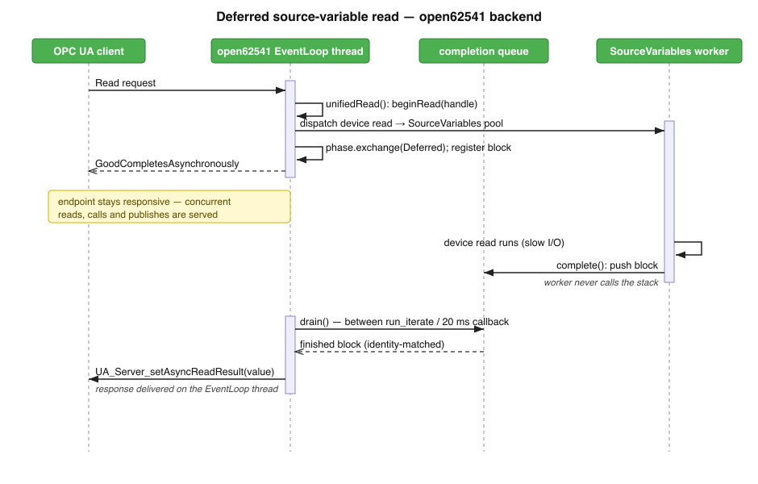

open62541 / UA SDK feature parity
=================================

Author: Paris Moschovakos

Date: June 2026

Support: quasar-developers@cern.ch

Overview
--------

A quasar server can be built against either OPC UA back-end: the commercial
Unified Automation C++ SDK (UA SDK), or the free and open-source open62541,
reached through the open62541-compat compatibility layer. **Feature parity**
means that the same quasar server, compiled against open62541-compat, behaves
identically to the one compiled against the UA SDK: the same OPC UA address
space, the same node ids, browse names, references, data types, access levels
and timestamps, and the same results from read, write and method-call
operations.

Parity is an engineering property of the compatibility layer, not a claim. It
was verified across the full set of production servers by building each server
twice -- once per back-end -- and comparing, between the two builds, the served
address space node-for-node and the outcomes of read, write and method calls.
The served address spaces and the operation results match. This document
records what open62541-compat had to implement to reach that point, organised
by the two areas where the back-ends used to diverge: observable
address-space and type fidelity, and asynchronous I/O.

The work spans open62541-compat 1.5.0 through 1.5.7. The 1.5 port moves the
bundled stack to open62541 1.5.4 and is anchored by asynchronous
read/write/call completion -- the feature that motivated the port and that
closes the last behavioural gap against the UA SDK.

Behavioural and address-space fidelity
--------------------------------------

The UA SDK fixes a set of observable behaviours -- status-code names, node-id
string formats, property namespaces and access levels, type semantics,
timestamps -- that quasar servers and their clients depend on.
open62541-compat now matches each of them. Most of these were latent
divergences that surfaced as production incidents: regex parsers segfaulting
on the wrong node-id shape, address-space walks counting nodes multiple times,
properties served with the wrong namespace or write access. The table below
lists the parity items; each is verified against UA SDK 1.6.5 headers and
carries a regression test.

.. list-table::
   :widths: 28 72
   :header-rows: 1

   * - Parity item
     - UA SDK behaviour, now matched
   * - Status-code aliases
     - Effectively the full ``OpcUa_*`` status-code family
       plus ``UaStatus`` with ``code()`` / ``statusCode()`` / ``toString()`` /
       ``isGood()``. open62541-compat carries 242 ``OpcUa_*`` aliases in total,
       214 of them generated from the stack's ``UA_StatusCode_name`` table plus
       a hand-curated core set. Partial aliasing previously broke production
       servers.
   * - Node-id string format
     - ``toFullString()`` renders ``NS<ns>|<Type>|<id>`` (e.g.
       ``NS2|String|elmb1.address``, ``NS0|Numeric|85``); ``toString()``
       returns the bare identifier. The old parenthesised ``(ns=2,...)`` shape
       was regex-hostile and segfaulted an eltek phase-lookup that indexed an
       empty match. Numeric/String/Opaque/Guid are all handled.
   * - Property browse-name namespace
     - A property under ns2 browses as ``2:name``: the property browse-name
       namespace follows the node id rather than being hardcoded to ns0.
       Hardcoding 0 produced ``0:name`` where the UA SDK serves ``2:name``
       (hundreds to over a thousand mismatched node pairs on real servers).
       Method Input/OutputArguments stay ns0 on both back-ends.
   * - Property access level
     - The access level passed to the ``UaPropertyCache`` constructor is
       applied to the served property node at AddNode. It was previously
       discarded, so every property exposed StatusWrite/TimestampWrite where
       the UA SDK serves CurrentRead only.
   * - ByteString semantics
     - ``UaVariant::toByteString`` returns a status code (``BadTypeMismatch``
       on mismatch, never throws) and round-trips both a ByteString scalar and
       a Byte array into a ``UaByteString``, honouring the empty-array
       sentinel.
   * - Empty/null typed values
     - An empty 1-D array stays an array, not a scalar or null
       (``UA_Array_new(0, ...)`` sentinel; ``isScalarValue()`` excludes it).
       Typed null-value variables are accepted at AddNode
       (``allowEmptyVariables = UA_RULEHANDLING_ACCEPT``); open62541 1.5
       otherwise rejects them, crashing servers that declare nullForbidden
       cache variables without an initial value.
   * - Server status
     - ``UaClient::ServerStatus`` enumerates Disconnected / Connected /
       ConnectionWarningWatchdogTimeout / ConnectionErrorApiReconnect /
       ServerShutdown / NewSessionCreated, and ``UaSession::serverStatus()``
       reports the live connection state (mapped from ``UA_Client_getState``)
       for client supervision loops.
   * - hvsys-class API surface
     - A verified subset of the broad UA SDK surface that hvsys-class servers
       compile against: ``UaString::toUtf8()``, ``UaQualifiedName(name, ns)``,
       ``UaNode::getTargetNodeByBrowseName`` / ``getUaReferenceLists``, the
       ``UaVariable`` abstract base, ``UaVariant::changeType``,
       ``UaDataValue`` setters/getters, ``UaDateTime::toTime_t/fromTime_t``,
       plus the forwarding headers and access-level constants.
   * - Timestamp order
     - ``UaDataValue(variant, statusCode, sourceTime, serverTime)`` takes
       *source* before *server*. The constructor parameter order was swapped
       to match, fixing silently transposed source/server timestamps at every
       construction site.
   * - Single reference registration
     - Each node's reference list is populated once. The compat layer stopped
       duplicating ``addReferencedTarget`` calls (quasar's ASNodeManager
       already populates them); doubling the edges broke recursive
       address-space walks that then counted nodes multiple times.

Asynchronous I/O
----------------

This is the central piece of the parity work. Under the UA SDK a device read,
write or method body can complete off the stack thread and be delivered later;
the bundled open62541 could not. open62541-compat now provides the same
contract: slow device I/O no longer stalls every session, subscription and
publish on the endpoint, because the operation is deferred off the single
EventLoop thread and completed when the device returns.

The open62541 1.5 enabler
~~~~~~~~~~~~~~~~~~~~~~~~~~~

The mechanism only exists in open62541 1.5. The bundled stack is now
**open62541 v1.5.4**, amalgamated with ``-DUA_MULTITHREADING=100`` (baked in at
amalgamation time). 1.5 introduces per-invocation deferral: a DataSource or
method callback returns ``UA_STATUSCODE_GOODCOMPLETESASYNCHRONOUSLY`` and the
result is posted later through three thread-safe completion functions --
``UA_Server_setAsyncReadResult``, ``UA_Server_setAsyncWriteResult``,
``UA_Server_setAsyncCallMethodResult`` -- with cancellation delivered through
the config's ``asyncOperationCancelCallback``. The pre-1.5 bundle could not
defer read or write at all: only CALL existed in the async enum, READ and
WRITE were commented-out placeholders, and the completion functions did not
exist in usable form, so a callback had to fill the result before returning.
``UA_MULTITHREADING >= 100`` is the precondition for calling the completion
functions safely.

The deferral seam
~~~~~~~~~~~~~~~~~

Deferral is opt-in on ``OpcUa::BaseDataVariableType`` and default-off, so
cache variables keep their synchronous fast path (no async block, no
handshake). The seam is three virtuals::

    virtual OpcUa_Boolean handlesIo() const { return OpcUa_False; }
    virtual void beginRead(AsyncReadHandle handle) { handle.complete(value(nullptr)); }
    virtual void beginWrite(const UaDataValue& dataValue, AsyncWriteHandle handle)
        { handle.complete(setValue(nullptr, dataValue, OpcUa_True)); }

The default ``beginRead``/``beginWrite`` complete inline immediately. A
subclass that returns ``handlesIo() == true`` and dispatches the handle to a
worker thread gets deferral. Methods do not use this seam: ``unifiedCall``
always allocates a block and hands it to the receiver's ``beginCall`` as the
``MethodManagerCallback``.

The operation block and the two-phase handshake
~~~~~~~~~~~~~~~~~~~~~~~~~~~~~~~~~~~~~~~~~~~~~~~~~

One primitive serves all three operations. An ``AsyncOperationBlock`` (heap,
``shared_ptr``-owned) carries the back-pointer to ``AsyncOperations``, the
stack's identifying pointer as the *key* (the ``UA_DataValue*`` target for a
read, the ``const UA_DataValue*`` for a write, the ``UA_Variant*`` output array
for a call), the payload slot, and a single-word ``std::atomic<int>`` phase
with ``Phase { Initial=0, Finished=1, Deferred=2 }``.

Completion is a release/acquire handshake on that atomic that guarantees
exactly one completer on every interleaving -- including the race where the
worker finishes before the glue regains control. The completing side stores
the payload then ``exchange(Finished)``; if the prior value was ``Deferred``
it pushes the block to the completion queue. The glue side, after ``begin*``,
does ``exchange(Deferred)``: if the prior value was ``Finished`` it consumes
the result inline and returns the operation's result (GOOD for a successful
read); otherwise it registers the block and returns
GOODCOMPLETESASYNCHRONOUSLY.

.. code-block:: cpp

    if (variable->handlesIo() && operations && operations->deferralActive())
    {
        std::shared_ptr<AsyncReadBlock> block = std::make_shared<AsyncReadBlock>(operations, dataValue);
        variable->beginRead(AsyncReadHandle(block));
        if (block->phase().exchange(AsyncOperationBlock::Deferred) == AsyncOperationBlock::Finished)
        {
            block->finishInline();
            return UA_STATUSCODE_GOOD;
        }
        operations->establishDeferral(block);
        return UA_STATUSCODE_GOODCOMPLETESASYNCHRONOUSLY;
    }

The read/write handle destructors complete with ``OpcUa_BadInternalError`` if
dropped without ``complete()``, so a misbehaving subclass cannot leave the
stack waiting forever. Method output copy is bounded by ``min(stored, arity)``
to stay in range for throwing methods.

The completion transport and EventLoop drain
~~~~~~~~~~~~~~~~~~~~~~~~~~~~~~~~~~~~~~~~~~~~~~

Workers never touch the stack. The only worker-side action is ``push()`` onto a
compat-owned completion queue (a mutex plus a vector); ``push()`` appends the
block, decrements the inflight counter, and notifies a condition variable. The
actual completion -- the result-memory write plus the
``UA_Server_setAsync*Result`` call -- happens in ``drain()``, which runs **on
the EventLoop thread**, where it is serialised with cancellation by
construction.

Drain runs at two points: between ``UA_Server_run_iterate`` calls in the run
thread, and from a 20 ms repeated server callback. Calling the completion
functions from inside the repeated callback is legal because the server locks
are reentrant. Deferred-completion latency is therefore bounded by one drain
period (<= 20 ms) on an otherwise idle server. Per-server reach is via
``config->context``, which holds the ``AsyncOperations`` instance.

Cancellation and the ABA guard
~~~~~~~~~~~~~~~~~~~~~~~~~~~~~~~~

Cancellation arrives through the config's ``asyncOperationCancelCallback``;
``cancel()`` erases the registry entry by key and touches nothing else. There
is an ABA hazard: after cancellation the stack may reuse the same key pointer
for a new operation, so a key match alone is insufficient. ``drain()``
therefore completes an entry only when the key is present **and** the
registered block is the same object:

.. code-block:: cpp

    for (auto& block : batch)
    {
        auto it = m_pending.find(block->key());
        if (it == m_pending.end() || it->second != block)
        {
            LOG(Log::INF) << "Dropping completion of a cancelled asynchronous operation";
            continue;
        }
        block->finishDeferred(server);
        m_pending.erase(it);
    }

Pointer-identity of the compat-owned ``shared_ptr`` -- which the allocator
cannot recycle while still referenced -- closes the hole. A cancelled
operation resolves cleanly: the registry entry is erased by ``cancel()``, the
worker still pushes into the queue, drain finds no matching identity and drops,
and the block frees by refcount. The pending registry is mutated only on the
EventLoop thread (creation, cancellation, consumption), so only the queue and
inflight accounting need the mutex.

The serving gate
~~~~~~~~~~~~~~~~~

Deferral is gated on the server's serving state. The glue defers only when
``handlesIo() && operations && operations->deferralActive()``, where
``deferralActive()`` is ``m_serving && !m_closed``. ``m_serving`` is set after
``linkServer``/``afterStartUp`` and before ``UA_Server_run_startup``. This is
the parity-preserving detail: stack-internal AddNode-time reads must complete
synchronously, so before the gate opens reads and writes take the synchronous
fallback path. Once ``m_closed`` is set in shutdown the gate refuses new
deferrals (reads/writes fall back to sync, calls return ``BadOutOfService``),
which matters because the shutdown iterations can still deliver client
requests.

Lifecycle and shutdown
~~~~~~~~~~~~~~~~~~~~~~~~

Wiring at ``start()``: construct ``AsyncOperations`` -> set
``config->context`` -> set the cancel callback -> register the 20 ms drain
callback -> ``linkServer``/``afterStartUp`` -> ``setServing()`` ->
``UA_Server_run_startup`` -> spawn the run thread.

Inflight is incremented under the queue mutex when a deferral is established
and always decremented at worker resolution (on completion push, or on
drop-when-closed). Shutdown sets ``m_closed`` and waits on the condition
variable for inflight to reach zero, with a 60 s timeout and a loud error on
expiry, then does a final drain while the server is still alive. All async
state is per-``UaServer`` (reached via ``config->context``, no static state),
so multiple in-process servers stay isolated.

Walkthrough: a deferred source-variable read
~~~~~~~~~~~~~~~~~~~~~~~~~~~~~~~~~~~~~~~~~~~~~~

#. An OPC UA client issues a Read. The stack calls into the glue on the
   EventLoop thread; ``unifiedRead`` allocates a block and calls
   ``beginRead(handle)``.
#. The source variable dispatches the device read to the SourceVariables
   worker pool and returns immediately.
#. The glue does ``phase().exchange(Deferred)``. The worker has not finished,
   so it registers the block and returns ``GoodCompletesAsynchronously`` to
   the client. The endpoint stays responsive -- concurrent reads, calls and
   publishes are served on the EventLoop thread.
#. The slow device read runs on a worker thread. When it finishes, the worker
   calls ``complete()``, which stores the value and pushes the block onto the
   completion queue. The worker never calls the stack.
#. On the next drain (between ``run_iterate`` calls or on the 20 ms callback)
   the EventLoop thread pops the block, confirms the registry entry matches by
   identity, and calls ``UA_Server_setAsyncReadResult``. The response is
   delivered to the client on the EventLoop thread.

quasar integration and the flavor matrix
-----------------------------------------

quasar dispatches device work through a single process-wide worker pool --
``Quasar::ThreadPool``, the SourceVariables thread pool -- created once at
startup by Meta's ``DSourceVariableThreadPool`` and fetched everywhere via
``SourceVariables_getThreadPool()``. Both back-ends share this one pool.
Dispatch policy is driven by Design.xml attributes and is identical under both
back-ends: async-declared reads/writes/methods queue to the pool and run on a
worker; sync-declared ones run inline in the calling thread. For source
variables a configured mutex is held while the device delegate runs (inline
for sync, inside the worker for async) so serialization matches regardless of
synchronicity or back-end. Synchronous methods do not lock the configured
method mutex (``addressSpaceCallUseMutex`` applies to asynchronous handlers);
this too is identical on both back-ends.

This mirrors the UA SDK IoManager job model directly. Under the UA SDK, I/O
reaches ``ASSourceVariableIoManager``, which calls
``SourceVariables_spawnIoJobRead/Write``; that constructs a generated
``IoJob`` (a ``Quasar::ThreadPoolJob``) and either runs ``job.execute()``
inline (synchronous job ids) or hands it to
``sourceVariableThreads->addJob(...)`` (asynchronous job ids). The open62541
back-end reimplements the same contract in
``ASSourceVariable::beginRead/beginWrite``: it builds an equivalent work lambda
and either runs it inline under the optional mutex (sync) or dispatches it via
``SourceVariables_getThreadPool()->addJob(work, description, mutex)`` (async).
The async-method handler in the generator is not guarded by back-end -- it
compiles identically for both and dispatches to the same pool. Cache variables
are pure in-memory address-space state with no device dispatch and no pool
under either back-end.

.. list-table::
   :widths: 20 40 40
   :header-rows: 1

   * - Node flavor
     - UA SDK
     - open62541
   * - Cache variable
     - In-memory address-space access; no dispatch, no mutex, no pool.
     - Same: in-memory, no dispatch.
   * - Source variable, async
     - ``spawnIoJobRead/Write`` news an asynchronous ``IoJob`` and calls
       ``sourceVariableThreads->addJob(job)``; runs on a pool worker, mutex via
       ``associatedMutex()``.
     - ``beginRead/beginWrite`` -> ``getThreadPool()->addJob(work, desc,
       mutex)``; runs on a pool worker, mutex held in the worker. Same pool.
   * - Source variable, sync
     - ``spawnIoJobRead/Write`` constructs a synchronous ``IoJob`` and calls
       ``job.execute()`` inline in the calling thread, under the job's mutex.
     - Work lambda run inline in the calling thread, under
       ``unique_lock(*mutex)`` when configured.
   * - Method, async
     - Generator handler (unguarded) dispatches via
       ``getThreadPool()->addJob(lambda, desc, mutex)``; pool worker, mutex per
       ``addressSpaceCallUseMutex``.
     - Identical code path, same pool, same mutex selection.
   * - Method, sync
     - Device call runs inline in the call thread.
     - Identical: inline in the call thread.

Every cell is behaviorally identical across the two back-ends. Async
source-variable and async method work share the one SourceVariables pool.

Behavioural notes
-----------------

Timestamps
~~~~~~~~~~

The deferred read path preserves the requested ``TimestampsToReturn`` policy:
the merge into the target data value polices timestamps on the deferred path
while the inline path leaves them as produced. The ``UaDataValue`` constructor
orders source before server, so source and server timestamps land in the
correct fields on both back-ends.

Monitored items and publishing
~~~~~~~~~~~~~~~~~~~~~~~~~~~~~~~~

Because deferred completions are issued on the EventLoop thread and the worker
never touches the stack, sampling, subscription and publish are unaffected by a
slow device read: while one operation is in flight on a worker, the EventLoop
thread continues to service other sessions, monitored items and publish
requests. This is the observable difference the async work delivers -- a slow
device no longer freezes the endpoint.

Synchronous-methods asymmetry
~~~~~~~~~~~~~~~~~~~~~~~~~~~~~~~

The deferral seam (``handlesIo`` / ``beginRead`` / ``beginWrite``) is for
source variables only. Methods always allocate a block and go through
``beginCall``, but a synchronous method still runs its device body inline in
the call thread under both back-ends -- only async-declared methods are
dispatched to the pool. The block machinery is uniform; the synchronicity is
decided by the Design, not by the seam.
