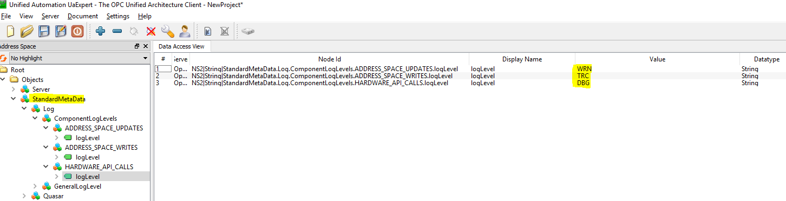

LogIt
=====

Logging in quasar is handled by the LogIt component. For instructions on
how to use LogIt generally, i.e. how to log specific messages from a
quasar server please refer to the `LogIt
repository <https://github.com/quasar-team/LogIt>`__.

Initializing LogIt in the Quasar Server code
--------------------------------------------

| As described above, the general means of logging via LogIt is
  documented `here <https://github.com/quasar-team/LogIt>`__. However,
  you will need to initialize LogIt in your quasar server - this section
  describes the hooks etc. provided by quasar where you, the developer,
  are expected to insert initialization code.
| Please read about `LogIt
  components <https://github.com/quasar-team/LogIt#components>`__. It's
  not long or complicated and you need to know about them.
| Presumably, the quasar server you write will perform tasks at runtime
  relating to different logical/functional/etc aspects of whatever it is
  the server actually does. Examples may include

-  sending commands to some target hardware (e.g. calling some 3rd party
   API)
-  accepting input (e.g. handling OPC-UA client item writes and method
   calls)
-  handling hardware disconnection/reconnection events

| The general idea of LogIt components is that each aspect has a
  dedicated logging component, the benefit of this is that LogIt allows
  you to raise and lower the logging
  `verbosity <https://github.com/quasar-team/LogIt#verbosity>`__ of
  these components in order to optimize the logging output according to
  the aspect you are interested in.
| Note: You, the quasar server developer, define the components and mark
  each log message in your code with component and a verbosity tag:
  TRACE, WARNING etc.
| The class QuasarServer (in sub-directory Server) is created in your
  project with a hook method for you to override, to initialize LogIt
  with the component IDs specific to your server implementation.

.. container::

   ::

      // file: QuasarServer.h
        virtual void initializeLogIt();
        
        // file: QuasarServer.cpp
        void QuasarServer::initializeLogIt()
        

| 
| The convention (!= rule: you are free to invent something better and
  let us know) in quasar servers is that LogIt component handles are
  declared as globals variables in file
  *Common/include/LogItComponentIds.h*, as per the sample code below

.. container::

   ::

      #ifndef COMMON_INCLUDE_LOGITCOMPONENTIDS_H_
        #define COMMON_INCLUDE_LOGITCOMPONENTIDS_H_
        
        #include <LogItStaticDefinitions.h>
        
        Log::LogComponentHandle HW_API_CALLS;
        Log::LogComponentHandle AS_WRITES;
        Log::LogComponentHandle AS_UPDATES;
        
        #endif /* COMMON_INCLUDE_LOGITCOMPONENTIDS_H_ */
        

| 
| These handles are then initialized in the hook method
  *QuasarServer::initializeLogIt*, as per the sample code below

.. container::

   ::

      void QuasarServer::initializeLogIt()
        {
          Log::initializeLogging();
          
          HW_API_CALLS = Log::registerLoggingComponent("HARDWARE_API_CALLS");
          AS_WRITES = Log::registerLoggingComponent("ADDRESS_SPACE_WRITES");
          AS_UPDATES = Log::registerLoggingComponent("ADDRESS_SPACE_UPDATES");
        
          LOG(Log::INF) << "Logging initialized.";
        }
        

| 
| The handles can subsequently be used anywhere in the code (where
  *LogItComponentIds.h* is included) to log messages to the specified
  component, as per this sample code

.. container::

   ::

      LOG(Log::INF, HW_API_CALLS) << "Use the HW_API_CALLS component to log messages related to hardware API calls";
        LOG(Log::INF, AS_WRITES) << "Use the AS_WRITES component to log messages related to input via the address space, e.g. client writes and method calls";
        LOG(Log::INF, AS_UPDATES) << "Use the AS_UPDATES component to log messages related to output via the address space, e.g. updating OPC items based on events received from the hardware";
        

Setting LogIt Component Verbosity
---------------------------------

Logging via LogIt is woven into the fabric of a quasar server. This
allows for an integrated approach to logging that allows you to
configure the verbosity of logging components both

-  initially, via the quasar server XML configuration
-  dynamically, via an OPC-UA client

Initial Verbosity: Via Server Config XML
----------------------------------------

The initial per-component verbosity can be configured in the server
configuration XML file. Taking the component IDs from the sample code
above (namely *HW_API_CALLS, AS_WRITES, AS_UPDATES*), the initial
per-component verbosity can be configured in the server configuration
file in the *StandardMetaData* root element as per the sample XML
snippet below

.. container::

   ::

        <StandardMetaData> 
            <Log>
              <GeneralLogLevel logLevel="INF"/>
              <ComponentLogLevels>
                <ComponentLogLevel componentName="HARDWARE_API_CALLS" logLevel="DBG"/>
                <ComponentLogLevel componentName="ADDRESS_SPACE_WRITES" logLevel="TRC"/>
                <ComponentLogLevel componentName="ADDRESS_SPACE_UPDATES" logLevel="WRN"/>
              </ComponentLogLevels>         
            </Log>
          </StandardMetaData>
        

Runtime Verbosity: Via an OPC_UA client
---------------------------------------

| Per-component verbosity can be read and set at runtime via standard
  quasar OPC-UA items (via *StandardMetaData.Log.ComponentLogLevels*).
  The screenshot below shows a graphical OPC-UA client (Unified
  Auomtation's uaexpert client) viewing these items. Writing a new
  verbosity value, for example, setting component
  *ADDRESS_SPACE_UPDATES* verbosity from *WRN* -> *TRC*, would result in
  all messages (TRC is the highest verbosity setting) for that component
  being delivered to the log.
| |screenshot of OPC-UA client setting log component verbosity|

Quasar Framework Maintainers: Dealing with LogIt as a Git Submodule
-------------------------------------------------------------------

Note that LogIt is its own independent component (it is used outside of
quasar). So, the quasar repository does not have its own local copy of
LogIt source code - quasar references LogIt source code in the LogIt
repo as a git submodule. This section describes how maintainers of the
quasar framework upgrade to newer versions of LogIt etc.

Which Version of LogIt is Quasar Using Now?
-------------------------------------------

Release versions of quasar should use only tagged versions (i.e.
releases) of LogIt. Assuming you have quasar cloned (**recursively!**)
to your development environment... check which LogIt tag is currently in
use via command *git submodule status*

.. container::

   ::

      $ git submodule status
         17d9805db6bbbfd94cbd8e80b3e2542c356b7169 LogIt (v0.1.0)
        

| 

Changing the Version of LogIt Quasar Uses
-----------------------------------------

So, let's say there's a new LogIt version -a LogIt tag- that quasar
should be using. There are 2 stages to updating to the new version

-  If LogIt uses new source files then update file
   *FrameworkInternals/original_files.txt* to reflect the modified
   source file list.
-  Update the submodule tag. Described below

According to `this
content <https://stackoverflow.com/questions/1777854/git-submodules-specify-a-branch-tag>`__,
the procedure for updating the LogIt submodule to the next tag is

.. container::

   ::

      cd LogIt
        git checkout vNewTag
        cd ..
        git add LogIt
        git commit -m "moved LogIt to vNewTag"
        git push
        

Then your fellow quasar maintainers update their environments with

.. container::

   ::

      git pull
        git submodule update --init --recursive
        

